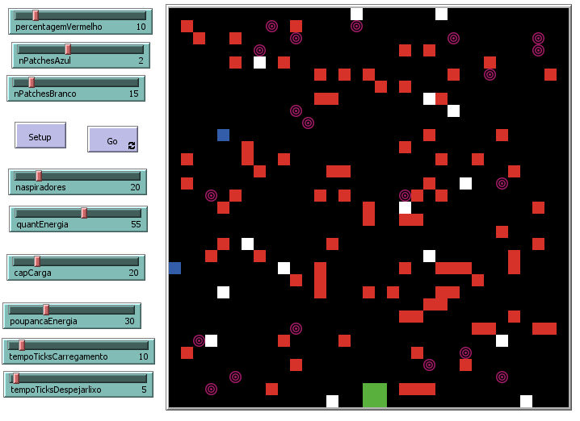
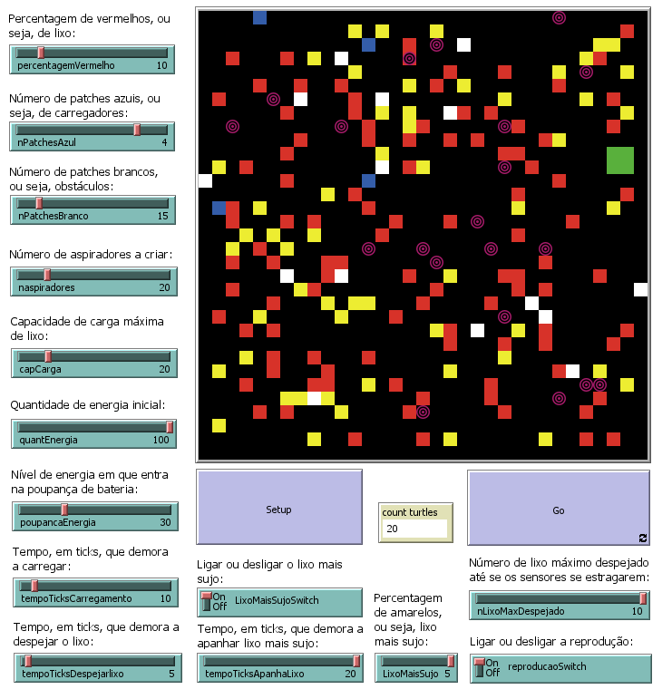

# Intelligent Vacuum Cleaner Agents — NetLogo Simulation

A simulation of **autonomous intelligent agents** that clean a dynamic environment using rational and reactive behavior.  
Developed in **NetLogo**, this project explores key **Artificial Intelligence** principles such as **perception**, **decision-making** and **cooperative behavior** in multi-agent systems.

## Overview

The system models a **closed, non-toroidal 2D grid environment** where multiple vacuum agents must:
- Collect dirt scattered across the map  
- Avoid obstacles and other dead agents  
- Recharge at charging stations when energy runs low  
- Deposit collected dirt at green “trash deposit” zones  

Two distinct versions were implemented and analyzed:
- **Base Model** — fundamental rational behavior with limited memory  
- **Improved Model** — enhanced perception, communication, and adaptive decision-making  

The goal is to evaluate how **intelligent behaviors** and **parameter tuning** affect cleaning performance, agent survival, and overall system efficiency.

## Technologies Used

- **NetLogo** – Multi-agent simulation platform  
- **Data Collection** – Experimental results analyzed via Excel and statistical comparisons  

## Environment Structure

The simulation world consists of cells with distinct colors, each representing a different element:

| Color | Meaning |
|--------|----------|
| **Black** | Clean floor |
| **Red** | Dirt (to be cleaned) |
| **Blue** | Charging station |
| **Green (4 adjacent cells)** | Trash deposit |
| **White** | Obstacles or dead agents |

Key parameters like the **percentage of dirt**, **number of chargers** and **obstacles** can be configured by the user before starting.

## Agent Design

Each **vacuum agent** is defined by:
- Energy level  
- Carrying capacity (max dirt it can hold)  
- Memory of known charger and deposit locations  
- Local perception range (adjacent cells)  

### Behavior Summary
- **Base Model**
  - Basic movement, cleaning, and charging logic  
  - Limited memory (only one charger and one deposit location)  
  - No reproduction or sensor degradation  

- **Improved Model**
  - Shares knowledge with nearby agents  
  - Stores multiple known charger and deposit locations  
  - Handles “dirtier” (yellow) cells requiring longer cleaning time  
  - Agents can reproduce if enabled (optional)  
  - Sensors degrade after multiple deposit cycles  

## Key Functions

### Base Model
- **Setup** – Initializes the environment and agents  
- **MoveAspiradores** – Main movement and action loop  
- **InfoNeighbour** – Shares knowledge between nearby agents  
- **MemorizaCarregador** – Saves charger coordinates upon discovery  
- **AheadWhite** – Avoids obstacles (random left/right rotation)  
- **LimitesModelo** – Prevents out-of-bounds movement  
- **StopWaitingCarregamento / StopWaitingLixo** – Manages waiting time for recharging or unloading  

### Improved Model (Additions)
- **MemorizaCarregadorNeighbours** – Shares charger info with neighbors  
- **MemorizaLixo** – Stores trash deposit location  
- **Sensores** – Detects and acts on nearby dirt, chargers, or deposits  
- **ReproduzAspiradores** – Allows replication when enabled  
- **StopWaitingLixoMaisSujo** – Handles cleaning of “dirty” (yellow) patches  
- **CheckFullCarregadores** – Checks if all chargers have been memorized  

## User Interface

### Base Controls
- **percentagemVermelho** – % of dirt on the map  
- **nPatchesAzul** – Number of chargers  
- **nPatchesBranco** – Number of obstacles  
- **nAspiradores** – Number of agents  
- **quantEnergia** – Initial energy  
- **capCarga** – Max carrying capacity  
- **poupancaEnergia** – Energy threshold for power-saving mode  
- **tempoTicksCarregamento** / **tempoTicksDespejarLixo** – Recharge and unload duration  
- **Setup** / **Go** – Buttons to initialize and start the simulation  

### Improved Controls
- **reproducaoSwitch** – Enable or disable agent reproduction  
- **LixoMaisSujoSwitch** – Enable “dirty” (yellow) patches  
- **tempoTicksApanhaLixo** – Time required to clean dirty patches  
- **nLixoMaxDespejado** – Maximum number of unload cycles before sensor failure  

## Experiments & Results

All experiments were performed over **10 iterations per scenario**, measuring:
- Average ticks until cleaning completion  
- Remaining uncleaned dirt  
- Average number of surviving agents  

Baseline configuration for most tests:
| Parameter | Base Value |
|------------|-------------|
| Obstacles | 15 |
| Energy | 100 |
| Power-Saving | 30 |
| Capacity | 20 |
| Chargers | 4 |
| Dirt % | 10 |
| Unload Ticks | 5 |
| Recharge Ticks | 10 |
| Agents | 20 |

Additional (Improved Model only):
| Parameter | Value |
|------------|--------|
| Dirty Patches | 4 |
| Cleaning Time | 20 |
| Max Unloads | 10 |

## Screenshots

### Base Model
The base model implements the fundamental rules of agent behavior: movement, cleaning, and recharging without advanced cooperation or extended memory.

### Improved Model
The improved version introduces **knowledge sharing**, **memory of multiple charger/deposit locations** and **advanced handling of “dirty” (yellow) patches**.

